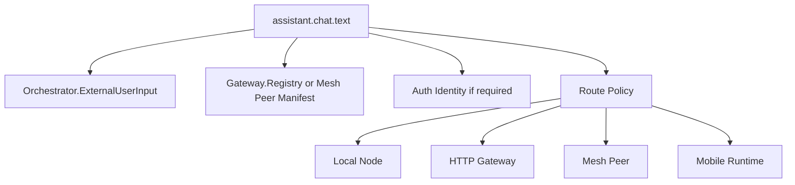
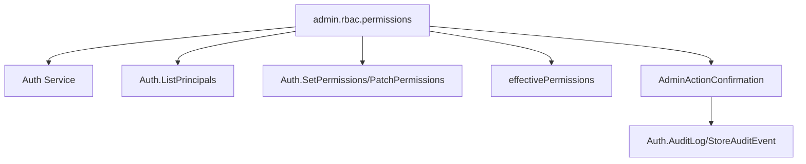
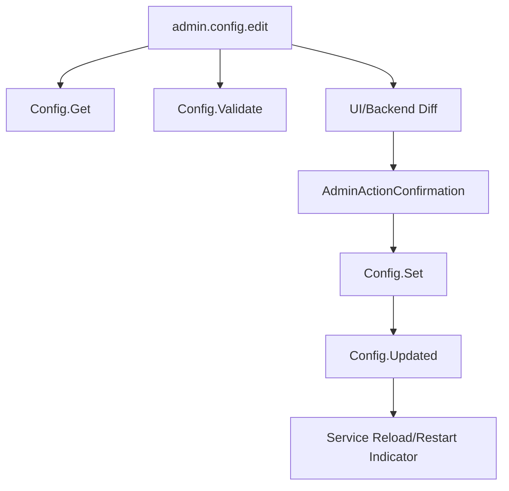
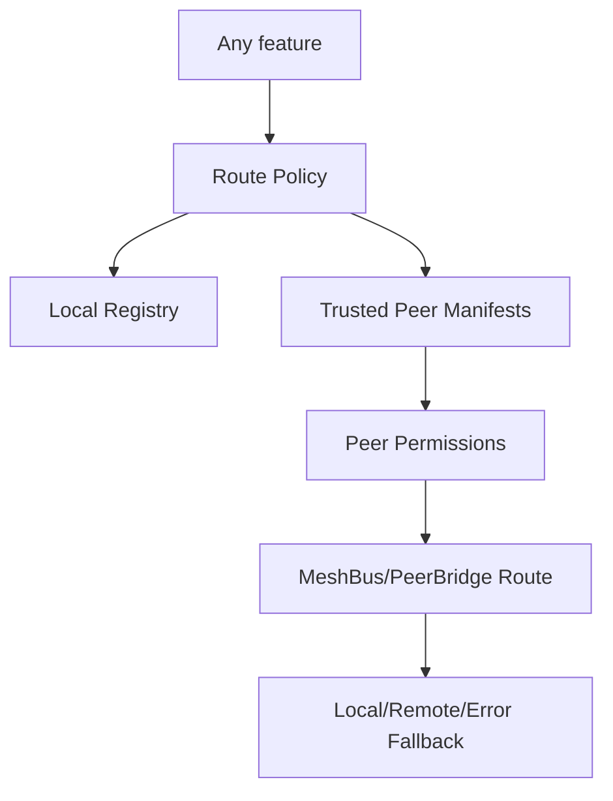

# Aurora UI Feature / Service / Module Availability Graph

Date: 2026-06-10  
Scope: planning graph mapping UI features to Aurora services, contracts, permissions, native platform capabilities, deployment modes, and gaps.  
Status: accepted planning baseline.

## 1. Legend

Deployment columns:

- **SW** — Server web / browser against HTTP Gateway.
- **DT** — Desktop thin Tauri client against server Gateway.
- **DL** — Desktop local/offline Tauri with bundled Aurora Python node in thread mode.
- **DM** — Desktop/standalone mesh shell using peer routes.
- **AT** — Android thin client.
- **AL** — Android local-light native/mobile runtime.
- **IT** — iOS thin client.
- **IL** — iOS local-light native/mobile runtime.

State codes:

- **A** available.
- **D** degraded/partial.
- **RO** read-only.
- **R** remote-only.
- **L** local-only.
- **P** needs permission/RBAC.
- **Pair** needs pairing/trust.
- **N** needs native permission/platform role.
- **M** missing service/contract.
- **U** unsupported platform.
- **?** requires spike/experiment.

## 2. Existing Aurora graph inputs

### 2.1 Services/modules in current contract model

- `Gateway`: service discovery, registry, HTTP/OpenAPI routes.
- `Auth`: login/session, pairing, principals, tokens, devices, audit, mesh credentials/peers.
- `Config`: get/set/validate/plugin/reload/config update.
- `Supervisor`: status/start/stop/restart/health.
- `Orchestrator`: user input, external user input, tool result, responses, health.
- `STT`, `WakeWord`, `Transcription`: listening, wakeword, transcription, audio events, health.
- `TTS`: synthesize/request/playback controls/events/health.
- `Tooling`: tools, tool stats, MCP status, execute/reload tools.
- `Scheduler`: schedule/cancel/pause/resume/list jobs, job events, health.
- `DB`: messages, RAG store/search/delete/list, cron jobs, users/devices/tokens/audit internals.
- `Mesh`: peer events and mesh peer models, with active runtime in Gateway/MeshBus.
- `AudioInput`: audio control.

### 2.2 Key contract evidence

- `GatewayMethods`: service announce/depart/heartbeat, registry/services/health (`app/shared/contracts/models/gateway.py:33-44`).
- `MethodInfo`: exposure, required permissions, method type, schemas (`app/shared/contracts/models/gateway.py:52-65`).
- `AuthMethods`: login, pairing, principals, tokens, devices, audit, mesh credential/peer management (`app/shared/contracts/models/auth.py:34-95`).
- `ConfigMethods`: get/set/updated/error/plugin/validate/reload/health (`app/shared/contracts/models/config.py:16-28`).
- `SupervisorMethods`: status, service control, health (`app/shared/contracts/models/supervisor.py:18-56`).
- `OrchestratorMethods`: user input/external input/tool result/response/health (`app/shared/contracts/models/orchestrator.py:18-25`).
- `MeshBus`: transparent local/remote request routing and event forwarding (`app/messaging/mesh_bus.py:1-28`, `86-180`, `283-340`).

## 3. Capability graph node model

Each UI feature should be represented as:

```yaml
feature:
  id: string
  label: string
  category: assistant | admin | mesh | model | native | diagnostics | config | tools | memory
  requiredServices: []
  requiredMethods: []
  requiredPermissions: []
  requiredNativeCapabilities: []
  requiredPlatformRoles: []
  privacyClass: public | personal | sensitive | secret | raw-audio | credential | admin-critical
  deploymentStates: { SW, DT, DL, DM, AT, AL, IT, IL }
  gaps: []
  notes: []
```

Graph edges:

- `feature -> service` (`requires_service`)
- `feature -> method` (`requires_method`)
- `feature -> permission` (`requires_permission`)
- `feature -> native_capability` (`requires_native`)
- `feature -> peer` (`can_route_to_peer`)
- `feature -> fallback_feature` (`degrades_to`)
- `feature -> audit` (`audits_to`)
- `feature -> config` (`configured_by`)

## 4. Assistant feature availability matrix

| Feature ID | UI surface | Required services/contracts | Permission/native gates | SW | DT | DL | DM | AT | AL | IT | IL | Gaps/notes |
|---|---|---|---|---|---|---|---|---|---|---|---|---|
| `assistant.chat.text` | Assistant composer | `Orchestrator.ExternalUserInput`, `Orchestrator.Response`, Gateway/mesh/native transport | Auth if gateway requires; route privacy | A | A | A | Pair | A | D/? | A | D/? | Need streaming response contract if not already event-backed. |
| `assistant.chat.streaming` | Response stream | Orchestrator response events or Gateway stream | event stream transport | M/? | M/? | M/? | M/? | M/? | M/? | M/? | M/? | Define WebSocket/SSE/EventStream contract. |
| `assistant.voice.ptt` | Push-to-talk | `STT.Listen`, `Transcription.Transcribe`, `Orchestrator.*`, `TTS.Request` optional | Mic permission, STT/TTS services | R/D | R/D | A | Pair/D | N/R | N/D/? | N/R | N/D/? | Mobile native mic bridge and audio streaming contract needed. |
| `assistant.voice.wake` | Wake mode | `WakeWord.Detect/Detected`, STT, Orchestrator | Mic + background/autostart | U | D/? | A | U/D | N/? | N/? | U | U/? | Android role/service spike; iOS no always-on Siri replacement. |
| `assistant.tts.playback` | Spoken replies | `TTS.Request/Synthesize/Stop/Pause/Resume` | speaker/audio route | R | R | A | Pair/R | R/N | N/? | R/N | N/? | Native TTS fallback could be added as plugin. |
| `assistant.interrupt` | Stop generation/TTS | TTS stop, orchestrator cancel missing | Auth/use | D | D | D | D | D | D | D | D | Need orchestrator cancellation contract. |
| `assistant.route.preview` | Route/privacy sheet | Capability graph, registry, mesh peers | peer trust + privacy | A | A | A | A | A | A | A | A | SDK computed; backend route explain endpoint optional. |
| `assistant.tool.approval` | Tool approval modal | `Tooling.GetTools`, `Tooling.ExecuteTool`, Orchestrator tool result | tool permissions | A | A | A | Pair | A | R/D | A | R/D | Need tool permission taxonomy for UI. |
| `assistant.history` | History screen | `DB.GetMessages`, `DB.GetMessagesForDate`, DB delete/update | personal data permission | A/P | A/P | A | Pair/P | A/P | R/D | A/P | R/D | Need exposure/RBAC status for DB history methods. |
| `assistant.memory.rag` | Knowledge/memory | `DB.RAG_*` | personal/sensitive | A/P | A/P | A | Pair/P | A/P | R/D/? | A/P | R/D/? | Mobile local vector DB optional future. |
| `assistant.attachments` | File/context attach | Tooling/DB/orchestrator attachments missing | filesystem/photos permission | M | M/N | M/N | M | M/N | M/N | M/N | M/N | Need attachment ingestion contract. |
| `assistant.share_intake` | Mobile share sheet/deep links | Native plugin + orchestrator | mobile OS share/deep link | U | D | D | D | N/? | N/? | N/? | N/? | Android Sharesheet + iOS Share Extension/App Intent prerequisites; Tauri/native plugin spike. |

## 5. Admin/operator availability matrix

| Feature ID | UI surface | Required services/contracts | Permission/native gates | SW | DT | DL | DM | AT | AL | IT | IL | Gaps/notes |
|---|---|---|---|---|---|---|---|---|---|---|---|---|
| `admin.overview` | Admin dashboard | Gateway services/registry/health, Auth whoami | admin/read permission | A/P | A/P | A/P | Pair/P | A/P | A/P | A/P | A/P | Capability graph drives cards. |
| `admin.services.list` | Services table | `Gateway.GetServices`, `/api/services`, `Gateway.GetRegistry` | auth as configured | A | A | A | Pair | A | A/D | A | A/D | Native-local mobile services subset only. |
| `admin.services.health` | Health drawer | `/api/services/{module}/health`, service health methods | auth | A | A | A | Pair | A | A/D | A | A/D | Need uniform health shape for all services. |
| `admin.services.control` | Start/stop/restart | `Supervisor.StartService/StopService/RestartService` | manage permission | P | P | P/A | Pair/P | P/R | U/D | P/R | U/D | Usually server/desktop only; mobile cannot control absent local services. |
| `admin.contracts.explorer` | Method explorer | Gateway registry/OpenAPI | admin/dev permission for test invoke | A | A | A | Pair | A | A | A | A | Test invoke must guard manage methods. |
| `admin.rbac.principals` | Users/principals | `Auth.List/Create/Get/Update/DeletePrincipal`, permissions | manage permissions | P | P | P | Pair/P | P | P/R | P | P/R | Existing contracts good. |
| `admin.rbac.permissions` | Permission builder | `Auth.SetPermissions/PatchPermissions`, registry required_perms | manage | P | P | P | Pair/P | P | P/R | P | P/R | Need permission catalog/grouping metadata. |
| `admin.tokens` | Token management | `Auth.ListTokens/CreateToken/UpdateTokenScopes/RevokeToken` | manage | P | P | P | Pair/P | P | P/R | P | P/R | One-time token reveal UX required. |
| `admin.devices` | Device management | `Auth.ListDevices/DeleteDevice` | manage | P | P | P | Pair/P | P | P/R | P | P/R | Existing contracts good. |
| `admin.pairing.queue` | Pairing approval | `Auth.PairingStart/Connect/Approve/Exchange` | approve/manage | A/P | A/P | A/P | Pair/P | A/P | A/P | A/P | A/P | Need pending pairing event/list endpoint? PairingConnect is code-based, no queue list visible. |
| `admin.mesh.peers` | Peer graph/detail | `Auth.MeshList/Get/Approve/Deny/Update/RemovePeer`, Mesh events | mesh manage | P | P | P | Pair/P | P | P | P | P | Existing peer mgmt strong; need UI route metrics endpoint. |
| `admin.config.view` | Config tree | `Config.Get`, schema/keys | config read/manage | P | P | P | Pair/P | P | P/R | P | P/R | Need schema metadata endpoint if not exposed. |
| `admin.config.edit` | Config editor/diff | `Config.Set`, `Config.Validate`, `Config.Updated` | manage + confirmation | P | P | P | Pair/P | P/R | D/R | P/R | D/R | Need backend diff/rollback or UI local diff only. |
| `admin.plugins` | Plugin mgmt | `Config.GetPlugin/SetPlugin`, Tooling reload/status | manage | P | P | P | Pair/P | P/R | D/R | P/R | D/R | Install/update signing is future gap. |
| `admin.audit` | Audit log | `Auth.AuditLog`, internal store audit | manage | P | P | P | Pair/P | P | P/R | P | P/R | Existing read contract good; audit every admin action in UI. |
| `admin.diagnostics.export` | Diagnostics wizard | Gateway/services/logs missing, sidecar/native logs | admin + redaction | M/D | M/D | M/D | M/D | M/D | M/D | M/D | M/D | Need diagnostics bundle contract. |
| `admin.backups` | Backup/restore | DB/config backup missing | admin critical | M | M | M | M | M | M | M | M | Future contract. |

## 6. Mesh/P2P availability matrix

| Feature ID | Required services/contracts | SW | DT | DL | DM | AT | AL | IT | IL | Gaps/notes |
|---|---|---|---|---|---|---|---|---|---|---|
| `mesh.identity.load` | Auth mesh identity/credential contracts | R | A | A | A | A | A | A | A | Needs secure storage mapping per platform. |
| `mesh.pair.request` | Pairing + WebRTC signaling | R | A | A | A | A | A | A | A | NAT/STUN/TURN UX decisions needed. |
| `mesh.peer.approve` | Auth MeshApprovePeer | P | P | P | P | P | P | P | P | Existing contract. |
| `mesh.route.policy` | Mesh config + routing table | M/D | M/D | M/D | M/D | M/D | M/D | M/D | M/D | Need external route policy read/write contract. |
| `mesh.route.preview` | SDK computed + peer manifests | A | A | A | A | A | A | A | A | Peer capability manifest schema needed. |
| `mesh.event.forwarding` | MeshBus event forwarding | D | D | D | D | D | D | D | D | UI should not assume high-frequency audio forwarding. |
| `mesh.diagnostics` | WebRTC/PeerBridge metrics | M | M | M | M | M | M | M | M | Need diagnostics endpoint/event contract. |

## 7. Model/runtime availability matrix

| Feature ID | Required services/contracts/native | SW | DT | DL | DM | AT | AL | IT | IL | Gaps/notes |
|---|---|---|---|---|---|---|---|---|---|---|
| `models.server.provider` | Orchestrator config/provider | A/P | A/P | A/P | Pair/P | A/P | R | A/P | R | Need UI-safe model provider contract. |
| `models.desktop.llamacpp` | local Python/service + llama.cpp/server | U | U/R | A/? | U/R | U | U | U | U | Existing deps optional; package/benchmark needed. |
| `models.desktop.vllm` | server/desktop GPU provider | R | R | A/? | R | R | R | R | R | Local desktop GPU only; not mobile. |
| `models.mobile.executorch` | Native mobile runtime plugin | U | U | U | U | U | ? | U | ? | Spike required. |
| `models.mobile.mlc` | Native mobile runtime plugin | U | U | U | U | U | ? | U | ? | Spike required. |
| `models.mobile.onnx` | Native mobile runtime plugin | U | U | U | U | U | ? | U | ? | Good for embeddings/classic ML; LLM suitability varies. |
| `models.download.import` | file/download manager, config, model registry missing | M | M/N | M/N | M | M/N | M/N | M/N | M/N | Need model catalog/download/import contract. |
| `models.benchmark` | runtime benchmark contract missing | M | M | M | M | M | M | M | M | Future contract required. |

## 8. Tools/automation/memory availability matrix

| Feature ID | Required services/contracts | SW | DT | DL | DM | AT | AL | IT | IL | Gaps/notes |
|---|---|---|---|---|---|---|---|---|---|---|
| `tools.registry` | `Tooling.GetTools/GetToolByName/GetStats` | A/P | A/P | A/P | Pair/P | A/P | R/D | A/P | R/D | Existing. |
| `tools.execute` | `Tooling.ExecuteTool` | P | P | P | Pair/P | P | R/D | P | R/D | Tool permissions/UI risk taxonomy needed. |
| `tools.mcp.status` | `Tooling.GetMCPStatus/ReloadMCPTools` | P | P | P | Pair/P | P/R | R/D | P/R | R/D | Reload is admin/high risk. |
| `scheduler.jobs` | `Scheduler.Schedule/Cancel/Pause/Resume/ListJobs` | P | P | P | Pair/P | P/R | R/D | P/R | R/D | Existing. |
| `memory.messages` | DB message contracts | P | P | P/A | Pair/P | P/R | R/D | P/R | R/D | Need exposure check in registry. |
| `memory.rag.collections` | DB RAG contracts | P | P | P/A | Pair/P | P/R | ? | P/R | ? | Mobile local vector storage not planned first. |

## 9. Native platform capability graph

| Native capability | Android | iOS | Desktop | Tauri/plugin implications | UI feature links |
|---|---|---|---|---|---|
| Microphone | Runtime permission | Runtime permission | OS-specific | native audio/permission plugin; browser getUserMedia in web | voice.ptt, wake |
| Notifications | Runtime permission/newer Android channels | APNs/local notification permission | native notifications | Tauri notification plugin | background status, reminders |
| Assistant role | `ROLE_ASSISTANT` if available + package qualifies + user/OEM consent | No Siri replacement | N/A | Android Kotlin Tauri plugin coordinates RoleManager; Android manifest/service declarations qualify package | Android assistant invocation |
| VoiceInteractionService | Available with manifest/permission; keep lightweight and hand off to UI/SDK | N/A | N/A | Manifest-declared Android service inside Tauri app/package, Kotlin native code, `BIND_VOICE_INTERACTION` where applicable | Android always-available assistant |
| App Intents/Shortcuts | N/A | App Intents/SiriKit/Shortcuts | macOS App Intents possible | Swift plugin/app extension | iOS invocation/actions |
| Share sheet | Android Sharesheet | iOS Share extension | file/deep-link | plugin/extension | share_intake |
| Biometrics | Android biometric | Face ID/Touch ID | OS-specific | Tauri biometric/Stronghold/keychain | admin confirmation, unlock |
| Secure storage | Android Keystore | Keychain | keychain/Stronghold | Tauri Stronghold/store/keyring | tokens, mesh creds |
| File picker/import | Android SAF | UIDocumentPicker/Photos | native dialogs/fs | Tauri fs/dialog plugins | attachments/model import |
| Local inference | ExecuTorch/MLC/ONNX/llama.cpp? | ExecuTorch/MLC/ONNX/CoreML/Metal | llama.cpp/vLLM/etc | native model runtime plugin | models.mobile/local assistant |

### 9.1 Android assistant package capability nodes

Android assistant support is now modeled as a group of native capability nodes rather than one boolean:

```yaml
native.android.tauri_plugin.loaded:
  requires: [official_tauri_android_shell, kotlin_plugin_registered]

native.android.assistant.role.available:
  requires: [RoleManager.ROLE_ASSISTANT available on device/profile]

native.android.assistant.package.qualified:
  requires:
    - AndroidManifest service/activity/metadata entries required by Android assistant role
    - VoiceInteractionService or equivalent qualifying entrypoint where required
    - android.permission.BIND_VOICE_INTERACTION on the service where applicable

native.android.assistant.role.held:
  requires:
    - native.android.assistant.role.available
    - native.android.assistant.package.qualified
    - user/OEM/policy grant

assistant.android.invocation.fallback:
  degrades_to: [app, notification, widget, shortcut, quick_tile, share_sheet, deep_link, server_route, mesh_route]
```

Planning consequence: Tauri/Kotlin support is accepted; the remaining assistant-role task is Android package qualification plus device/OEM matrix testing.

## 10. Missing backend/API contract gaps

Priority order for future implementation planning:

1. **Event stream contract** — unified streaming/events endpoint for Orchestrator/STT/TTS/Config/Mesh/Health.
2. **Capability manifest endpoint** — derived from registry, identity, permissions, native and peer state; can initially be SDK-computed.
3. **Peer capability manifest** — mesh peer service/method/permission/latency/trust/route quality.
4. **Route preview/explain contract** — optional backend support to explain selected route and fallback.
5. **Model runtime/catalog contract** — providers, local models, downloads/imports, hardware, benchmarks.
6. **Attachment/context ingestion contract** — files, URLs, images, share sheet content, privacy class.
7. **Orchestrator cancellation/interrupt contract** — stop generation/tool runs separate from TTS stop.
8. **Diagnostics bundle contract** — redacted logs, registry, health, traces, sidecar/native logs.
9. **Config schema/metadata endpoint** — UI-readable schema with descriptions, source, restart requirements.
10. **Config diff/rollback contract** — safer admin config flow.
11. **Permission catalog/grouping metadata** — human-readable RBAC templates tied to method required_perms.
12. **Pairing queue/list contract** — admin queue of pending pairing requests, not only code-based connect/approve.
13. **Tool risk taxonomy** — read/mutate/external/admin/tool-specific approval requirements.
14. **Backup/restore contract** — DB/config/model export/restore.
15. **Native mobile capability bridge contract** — OS permissions, App Intents, Android assistant role, local inference. Android Tauri/Kotlin bridge is feasible; assistant role requires package qualification metadata in native capability manifest.

## 11. Feature graph dependency snippets

### 11.1 Assistant text graph



### 11.2 Admin RBAC graph



### 11.3 Config edit graph



### 11.4 Mesh route graph



## 12. Implementation-order implications

This graph implies the future task order should be:

1. SDK transport + registry ingestion.
2. Capability graph and fixtures.
3. Auth/session/pairing flows.
4. Admin read-only dashboard surfaces.
5. Assistant text flow.
6. Admin mutation confirmation/audit framework.
7. Config/RBAC/token/device/mesh management.
8. Event streaming and richer assistant voice.
9. Desktop local sidecar lifecycle.
10. Mobile thin client.
11. Native mobile capability plugins.
12. Mobile local-light inference.
13. Advanced diagnostics/backup/model catalog.

Do not build screens before capability graph fixtures; otherwise every mode will fork and drift.


## 12. Production task-generation coverage gates added 2026-06-14

The standalone matrix `.omx/specs/ui-refinement/spec-vs-code-coverage-matrix.md` is now the required bridge between this feature graph and final task creation. Every production task must link to one matrix row and declare:

- feature id;
- backend status: `implemented`, `partial`, `internal_only`, `missing_contract`, `planned`, or `mock_only`;
- mock status;
- required backend route/contract changes;
- SDK adapter/facade changes;
- UI screen/component changes;
- canonical permissions;
- privacy class;
- platform/transport modes;
- verification evidence.

### 12.1 Rows that must not be collapsed

Do not merge these concerns during task generation:

1. `gateway.method_exposure_matrix` — method metadata and route availability.
2. `auth.session.state_machine` — auth disabled/API-key/bearer/expired/401/403/pairing recovery.
3. `permissions.catalog` — canonical backend permission IDs and friendly grouping.
4. `admin.action.envelope` — backend-enforced admin safety.
5. `voice.audio.mode_matrix` — local capture, remote transcription, local playback and native permission split.
6. `mesh.peer_state_split` — persisted peers vs live WebRTC peers.
7. `diagnostics.bundle` — redacted support export backend contract.
8. `models.catalog.runtime` — model provider/import/download/benchmark/mobile runtime contracts.
9. `assistant.attachments` and `assistant.share_intake` — context ingestion and mobile share bridge.
10. `native.android.assistant_role` and `native.ios.invocation` — Android role qualification vs iOS non-Siri integration.

### 12.2 Backend-route additions implied before production completion

The full UI cannot be production-complete until these backend/API gaps are either implemented or explicitly marked out of scope for a release:

1. unified event stream / subscription contract;
2. AdminAction draft/confirm/audit enforcement;
3. capability manifest endpoint or formal SDK-computed manifest;
4. peer capability manifest and mesh route diagnostics;
5. route preview/explain policy contract;
6. diagnostics bundle export/redaction/audit;
7. backup/restore/rollback contracts;
8. model catalog/import/download/benchmark contracts;
9. attachment/context ingestion and mobile share intake contracts;
10. orchestrator cancellation/interrupt contract;
11. config rollback/version/reload-impact preview;
12. tool risk/approval metadata;
13. pending pairing queue/list/event if the admin pairing queue remains first-class.
