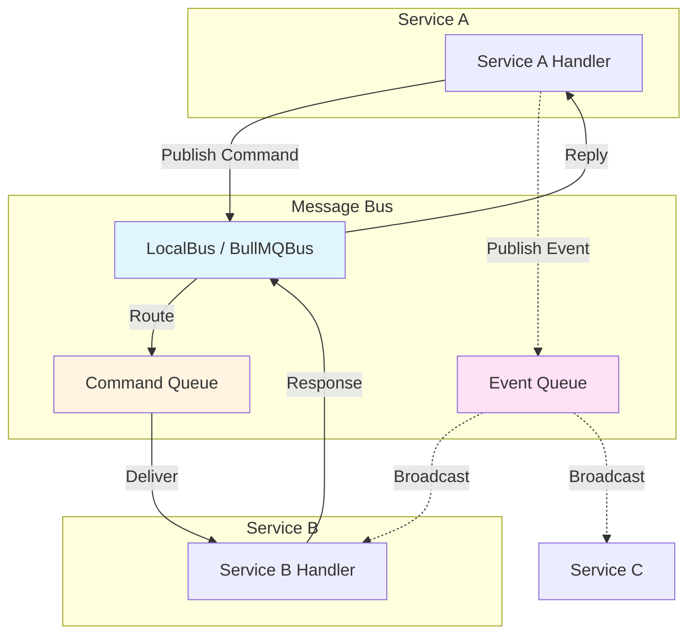
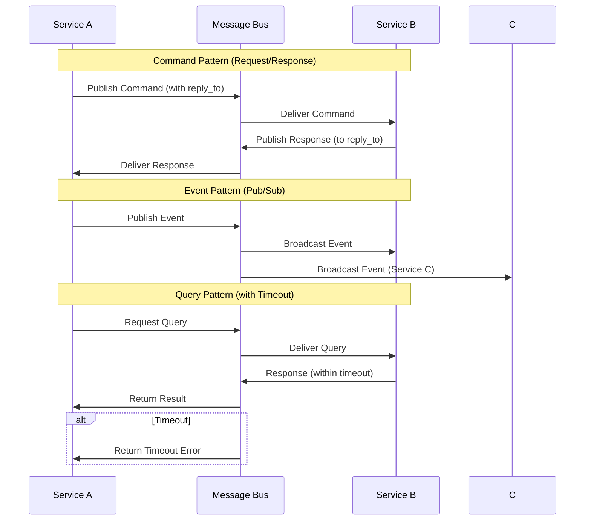
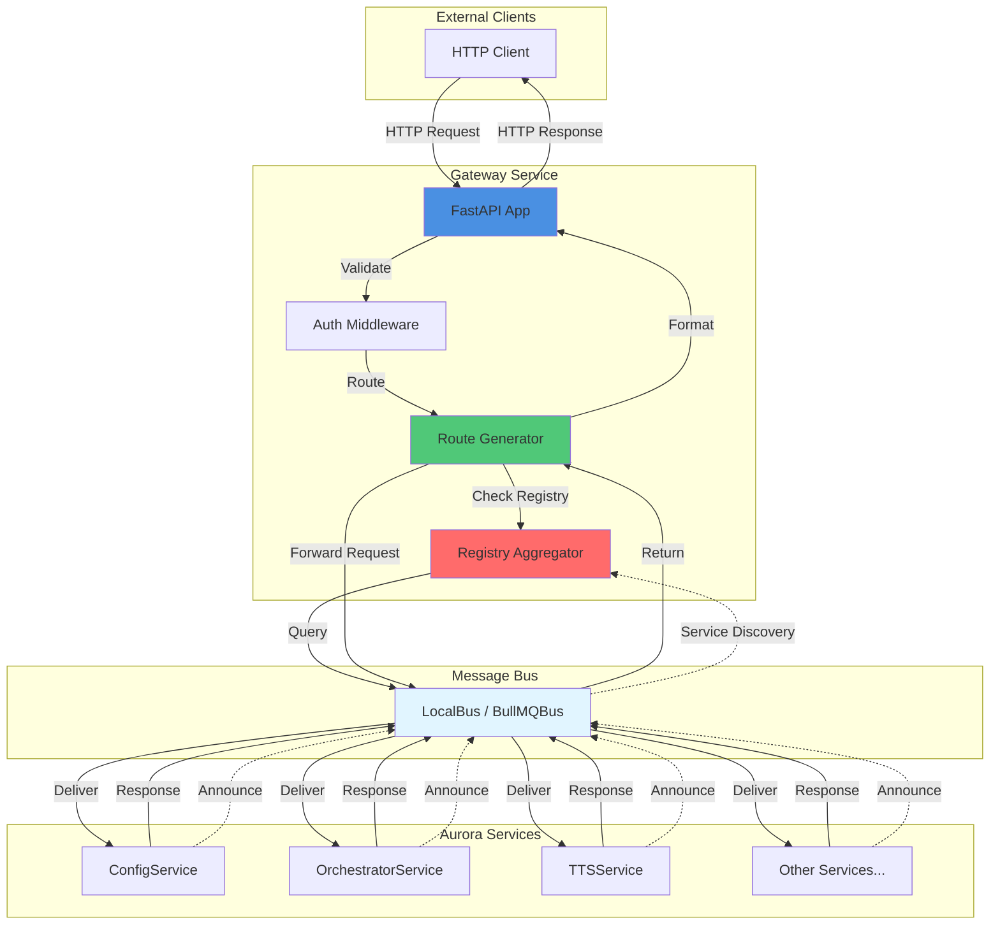
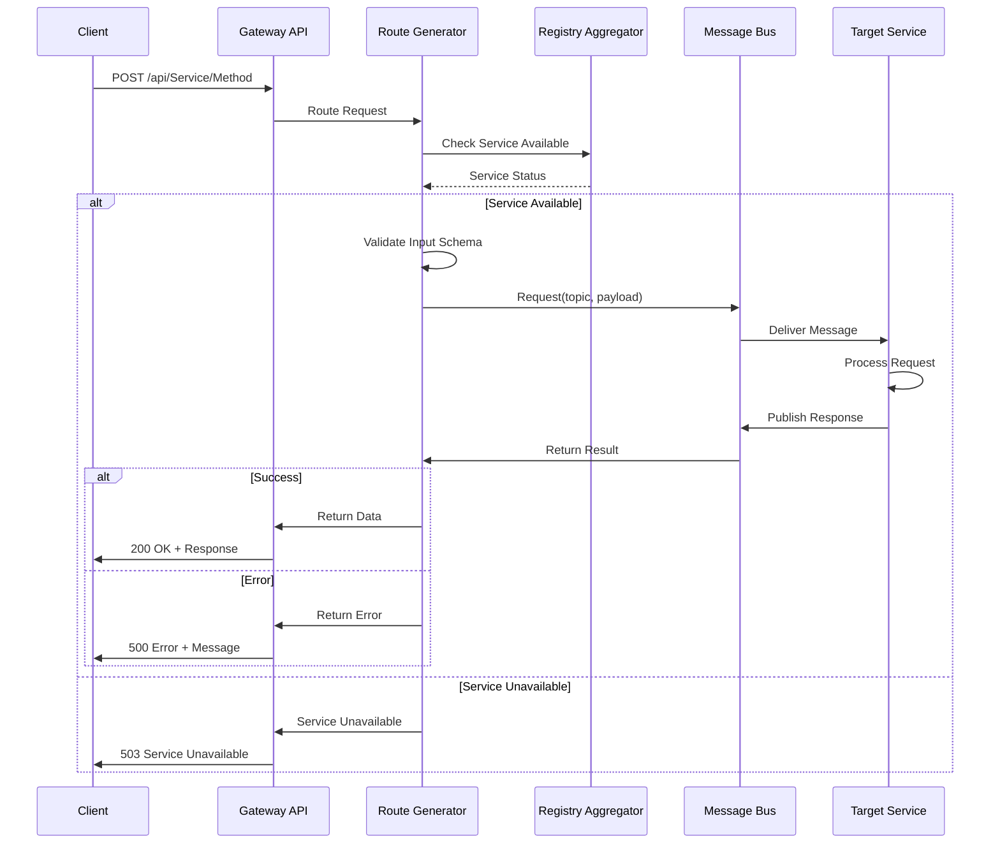
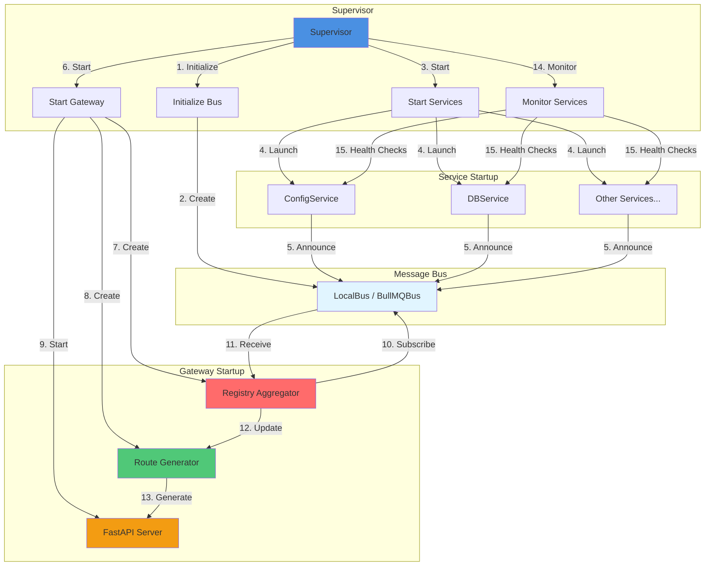
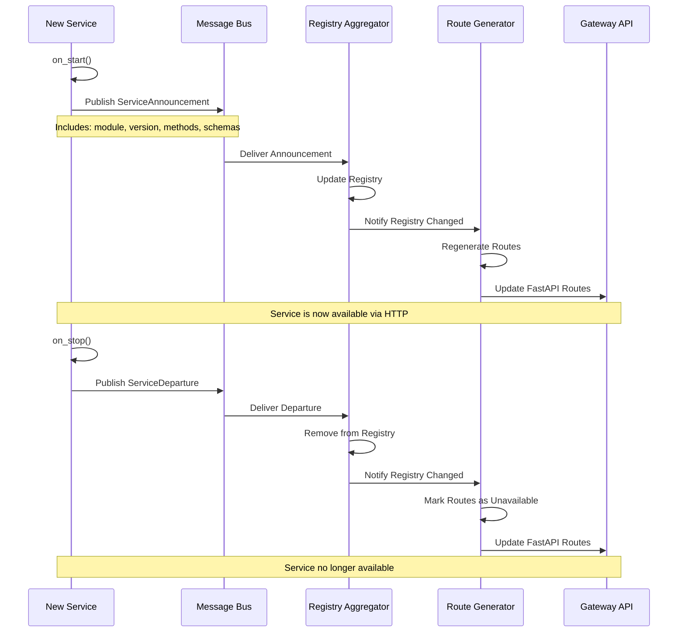

# Aurora Architecture

This document provides an overview of Aurora's architecture, service structure, and design patterns.

## Overview

Aurora is a modular voice assistant built with a microservices architecture that can run in two modes:
- **Threads Mode**: All services run in the same process (default, for development)
- **Processes Mode**: Each service runs as a separate OS process (for production)

## Service Structure

### Core Services

Aurora consists of the following services:

1. **ConfigService** (`app/services/config/`)
   - Manages application configuration
   - Provides config API for other services
   - Handles config reload events

2. **DBService** (`app/services/db/`)
   - Database persistence and retrieval
   - Message history management
   - RAG (Retrieval-Augmented Generation) storage
   - Cron job storage

3. **OrchestratorService** (`app/services/orchestrator/`)
   - LangGraph agent coordination
   - LLM integration (OpenAI, HuggingFace, llama.cpp)
   - Conversation management

4. **TTSService** (`app/services/tts/`)
   - Text-to-speech synthesis
   - Audio output management

5. **STT Services** (`app/services/stt_*/`)
   - **STTCoordinatorService**: Coordinates STT operations
   - **STTTranscriptionService**: Handles transcription
   - **STTWakewordService**: Detects wake words

6. **SchedulerService** (`app/services/scheduler/`)
   - Scheduled task management
   - Cron job execution

7. **ToolingService** (`app/services/tooling/`)
   - Tool management (core, plugin, MCP)
   - Tool execution
   - MCP (Model Context Protocol) integration

8. **GatewayService** (`app/services/gateway/`)
   - HTTP REST API gateway for all services
   - Dynamic service discovery via message bus
   - Automatic route generation from service contracts
   - OpenAPI/Swagger documentation
   - WebRTC peer authentication with DataChannel auth gate
   - Pairing and login RPC methods (accessible by anonymous peers)
   - Room auto-generation and encrypted MQTT presence
   - P2P mesh networking for cross-instance service sharing
   - See [Gateway Documentation](./GATEWAY.md) for details

9. **Supervisor** (`app/services/supervisor.py`)
   - Service lifecycle management
   - Architecture mode selection
   - Service startup/shutdown coordination
   - Gateway lifecycle management

### Service Directory Structure

```
app/
├── shared/              # Shared code used by all services
│   ├── config/          # Configuration interface
│   ├── contracts/       # API contracts and models
│   ├── messaging/       # Message bus initialization
│   └── services/        # Base service abstraction
├── services/            # Individual service implementations
│   ├── config/
│   ├── db/
│   ├── orchestrator/
│   ├── scheduler/
│   ├── tts/
│   ├── tooling/
│   └── stt_*/
└── helpers/             # Utility functions
```

## Message Bus Architecture

Aurora uses a message bus abstraction for inter-service communication:

### Bus Implementations

1. **LocalBus** (Threads Mode)
   - In-process message passing
   - Low latency
   - Shared memory

2. **BullMQBus** (Processes Mode)
   - Redis-backed message queue
   - Distributed communication
   - Horizontal scalability

### Message Types

- **Commands**: Point-to-point messages with guaranteed delivery
- **Events**: Broadcast messages for pub/sub patterns
- **Queries**: Request/response pattern with timeouts

### Message Priority

- **Interactive** (10): User interactions, highest priority
- **System** (50): Background tasks, medium priority
- **External** (80): External API requests, lowest priority

### Service Communication Flow



### Inter-Service Communication Patterns



## Contract Registry System

Aurora uses a contract registry to define and expose service APIs:

### Contract Definition

Services define contracts using the `@method_contract` decorator:

```python
@method_contract(
    method_id="TTS.Request",
    summary="Request TTS synthesis",
    input_model=TTSRequest,
    output_model=TTSResponse,
    exposure="both"
)
async def synthesize(self, request: TTSRequest) -> TTSResponse:
    # Implementation
    pass
```

### Contract Registration

Contracts are automatically registered when services inherit from `BaseService`:

1. Service inherits from `BaseService`
2. `BaseService.__init__` scans for `@method_contract` decorators
3. Contracts are registered in the global registry
4. Methods are auto-subscribed to message bus topics

## Process vs Threads Mode

### Threads Mode (Default)

- **Architecture**: All services in one process
- **Communication**: LocalBus (in-memory)
- **Use Case**: Development, testing, single-machine deployments
- **Benefits**: Low latency, simple setup, shared memory
- **Limitations**: No horizontal scaling, single point of failure

### Processes Mode

- **Architecture**: Each service in separate OS process
- **Communication**: BullMQBus (Redis)
- **Use Case**: Production, distributed deployments
- **Benefits**: Horizontal scaling, process isolation, fault tolerance
- **Requirements**: Redis server

### Mode Selection

Set via environment variable or config:

```bash
export AURORA_ARCHITECTURE_MODE=processes
export REDIS_URL=redis://localhost:6379
```

Or in `config.json`:

```json
{
  "general": {
    "architecture": {
      "mode": "processes"
    }
  },
  "messaging": {
    "redis": {
      "url": "redis://localhost:6379"
    }
  }
}
```

## Configuration Management

### Config Service

The ConfigService provides a centralized configuration API:

```python
from app.shared.config.interface import ConfigAPI

config_api = ConfigAPI()
config = config_api.get_config()
```

### Config Reload

Services subscribe to config change events and reload automatically:

1. ConfigService publishes `Config.Changed` event
2. Services receive event via message bus
3. Services call `reload()` method with affected section
4. Services update internal state

### Config Structure

Configuration is stored in `config.json`:

```json
{
  "app": {
    "name": "Aurora",
    "version": "1.0.0"
  },
  "llm": {
    "provider": "openai",
    "model": "gpt-4"
  },
  "tts": {
    "voice_model": "path/to/model"
  }
}
```

## Base Service Abstraction

All services inherit from `BaseService`:

### Features

- **Bus Access**: Automatic bus initialization via singleton
- **Lifecycle Management**: `start()`, `stop()`, `on_start()`, `on_stop()`
- **Config Reload**: `reload()` method for config changes
- **Contract Registration**: Automatic contract registration
- **Auto-Subscription**: Methods auto-subscribe to message bus

### Service Implementation Pattern

```python
from app.shared.services.base_service import BaseService

class MyService(BaseService):
    def __init__(self):
        super().__init__(
            module="MyService",
            summary="My service description",
            capabilities=["capability1", "capability2"]
        )
    
    async def on_start(self):
        # Service-specific startup
        pass
    
    async def on_stop(self):
        # Service-specific shutdown
        pass
    
    async def reload(self, config_section: str | None = None):
        # Handle config reload
        pass
```

## Process Launcher

The ProcessLauncher manages service processes in processes mode:

### Features

- Start/stop services as subprocesses
- Process monitoring
- Log collection
- Statistics collection

### Usage

```python
from app.shared.services.process_launcher import ProcessLauncher

launcher = ProcessLauncher()
launcher.start_service("ConfigService", "app.services.config")
# ... later
launcher.stop_all()
```

## Health Checks

Services implement health check endpoints:

### Health Check Response

```python
{
    "status": "healthy" | "degraded" | "unhealthy",
    "checks": {
        "bus": "ok" | "error",
        "config": "ok" | "error",
        ...
    },
    "timestamp": "2025-01-XX...",
    "service": "ServiceName"
}
```

### Health Check Utility

```python
from app.shared.services.health import check_service_health

health = await check_service_health("ConfigService")
```

## Docker Architecture

Aurora services can be containerized:

### Service Images

Each service has its own Dockerfile:
- `docker/services/Dockerfile.config`
- `docker/services/Dockerfile.db`
- `docker/services/Dockerfile.orchestrator`
- etc.

### Docker Compose

Process mode can be run via Docker Compose:

```bash
docker-compose -f docker-compose.process.yml up
```

## Gateway Architecture

The Gateway provides HTTP REST API access to all Aurora services. It dynamically discovers services and generates routes from service contracts.

### Gateway Components



### Gateway Request Flow



### Supervisor and Gateway Lifecycle



### Service Discovery Protocol



## Related Documentation

- [GATEWAY.md](./GATEWAY.md): Complete gateway documentation
- [MESSAGING_ARCHITECTURE.md](./MESSAGING_ARCHITECTURE.md): Detailed message bus documentation
- [TESTING_PROCESS_MODE.md](./TESTING_PROCESS_MODE.md): Process mode testing guide
- [README.process-mode.md](../README.process-mode.md): Process mode overview
- [TECHSTACK.md](./TECHSTACK.md): Technology stack details
