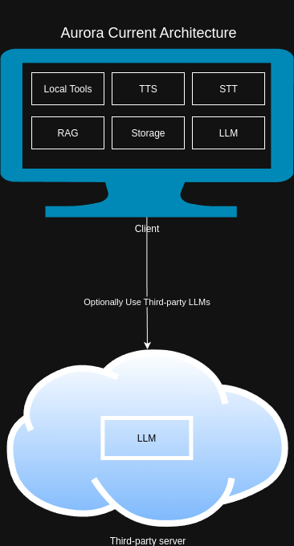
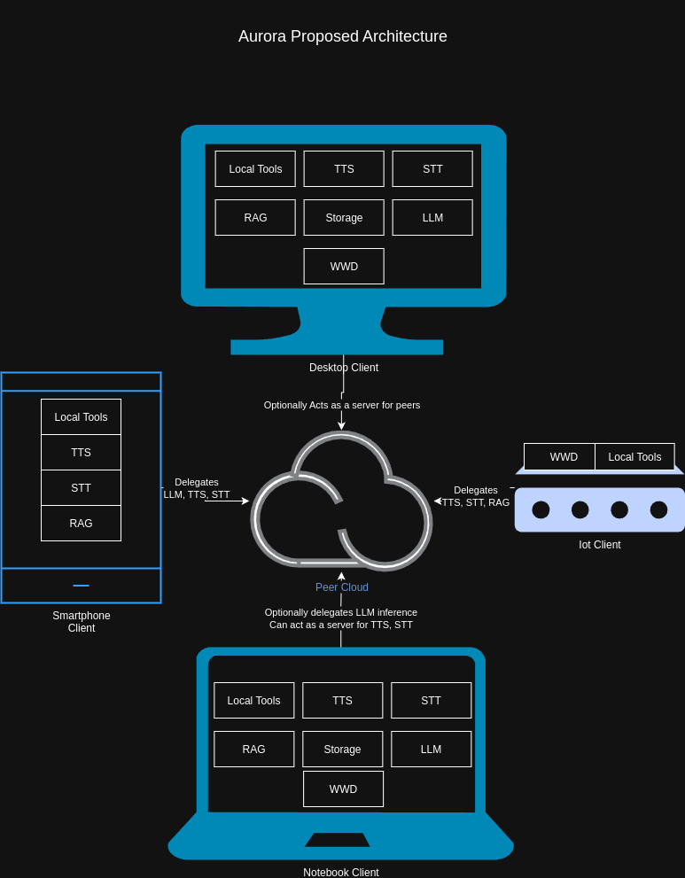
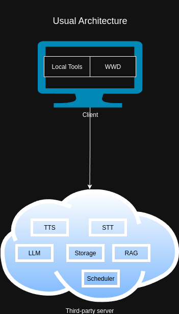
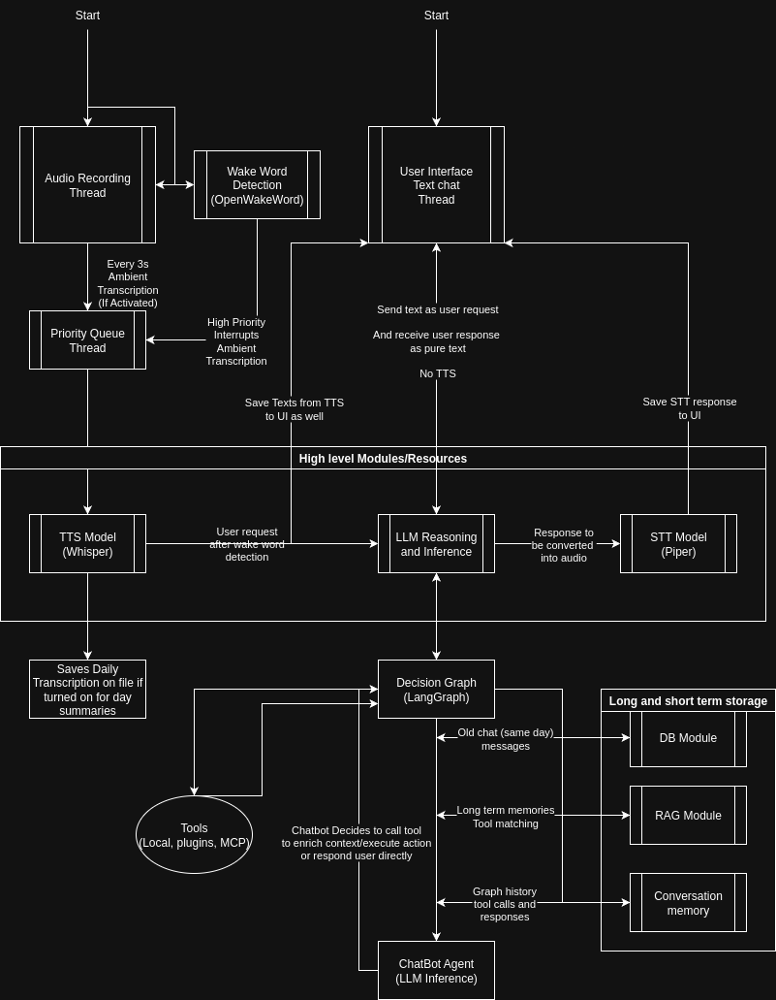

# Distributed System Design Proposal: Aurora Mesh Architecture

## 1. Executive Summary

This proposal outlines the architectural transformation of Aurora from a single-device, local-first voice assistant into a **privacy-preserving distributed mesh network**. 

The goal is to enable Aurora to run in multiple topologies—fully local, client-server, or peer-to-peer (P2P)—allowing users to selectively offload intensive tasks (like LLM or STT) to more powerful devices in their personal network without sacrificing the core privacy guarantee: **data stays within the user's controlled mesh.**

---

## 2. Definitions

The following terms and acronyms are used throughout this architecture proposal:

| Term | Definition |
|------|------------|
| **LLM** | **Large Language Model**. A deep learning model capable of understanding and generating human-like text (e.g., GPT-4, Llama 3). In Aurora, this is the "Cognition" engine. |
| **STT** | **Speech-to-Text**. Technology that converts spoken audio into text. Used for user input processing. |
| **TTS** | **Text-to-Speech**. Technology that converts text into spoken audio. Used for assistant responses. |
| **P2P** | **Peer-to-Peer**. A distributed network architecture where participants (peers) connect directly to each other without a central server. |
| **RPC** | **Remote Procedure Call**. A protocol that allows a program to execute a function on another computer as if it were a local function call. |
| **WebRTC** | **Web Real-Time Communication**. An open standard for real-time communication of audio, video, and data over peer-to-peer connections. |
| **NAT** | **Network Address Translation**. A method used by routers to remap IP addresses, often preventing direct connections between devices on different private networks. |
| **STUN** | **Session Traversal Utilities for NAT**. A protocol used by WebRTC to help devices discover their public IP address and port to establish a P2P connection. |
| **TURN** | **Traversal Using Relays around NAT**. A protocol used by WebRTC to relay data through a server when a direct P2P connection cannot be established (e.g., stringent firewalls). |
| **RBAC** | **Role-Based Access Control**. A security approach that restricts system access to authorized users based on assigned roles and permissions. |
| **ACL** | **Access Control List**. A list of permissions attached to an object (or service method) specifying which users/peers are granted access. |
| **API** | **Application Programming Interface**. A defined set of rules and protocols for building and interacting with software applications. |
| **GPU** | **Graphics Processing Unit**. Specialized hardware designed for parallel processing, essential for running local LLMs and TTS/STT models efficiently. |
| **CI** | **Continuous Integration**. The practice of automating the integration of code changes from multiple contributors into a single software project. |
| **RAG** | **Retrieval-Augmented Generation**. An AI technique that optimizes LLM output by referencing an authoritative knowledge base (like Aurora's vector database) before generating a response. |
| **MCP** | **Model Context Protocol**. A standard for connecting AI assistants to data and tools, used by Aurora for external integrations. |

---

## 3. Architecture Evolution

### 3.1 Current State: Local Monolith (Threads Mode)
Currently, Aurora operates primarily as a standalone application. All components (transcription, orchestration, TTS) run within a single process or local thread pool. While this maximizes privacy and simplicity, it limits performance to the capabilities of a single device.

### 3.2 Proposed State: Distributed Mesh (Process & P2P Mode)
The proposed architecture introduces a "Mesh Mode". Aurora nodes can discover each other via peer-to-peer protocols (WebRTC). Users can configure specific modules to be *shared* (e.g., a high-end GPU PC sharing "LLM Service") or *consumed* (e.g., a Raspberry Pi consuming "STT Service").

Key characteristics of this state:
- **Decentralized Control**: No central cloud server for data processing.
- **Selective Sharing**: Users explicitly define which services are local vs. remote.
- **Transparent Routing**: Internal services call methods (e.g., `TTS.Generate`) without knowing if the provider is local or remote.

---

## 4. Core Software Architecture

To support this distributed nature without rewriting the application logic for every topology, the internal software architecture builds upon an "Agentic" model. The system is composed of modular services wrapped in a robust contract layer.

*The internal loop of perception (STT), cognition (LLM/LangGraph), and action (Tools/TTS) remains consistent, regardless of where individual components execute physically.*

---

## 5. Critical Architectural Decisions

To bridge the gap between the current and proposed state, the following ten architectural decisions are proposed. Each decision is foundational to achieving flexible distribution while maintaining maintaining strict privacy boundaries.

### Decision 1: Service-Modular Architecture with Explicit Contracts
**Proposal:** Organize all core capabilities (STT, TTS, Orchestrator) as independent services defined by strict **Method Contracts** (Pydantic models + metadata).
**Why it is important:** 
This decouples the *implementation* of a service from its *invocation*. By defining strict contracts (Input/Output schemas), we can automatically generate API gateways, validate mesh RPC calls, and ensure that a remote service behaves exactly like a local one. It is the "lingua franca" that makes distribution possible.

### Decision 2: Pluggable Message Bus Abstraction
**Proposal:** Implement a unified `Bus` interface with two distinct underlying implementations:
1.  **LocalBus**: In-memory `asyncio` queues for single-device efficiency (low latency).
2.  **BullMQ/Redis Bus**: Distributed queues for multi-process scalability.
**Why it is important:**
This allows the *same application code* to run on a constrained device (using threads) or a server farm (using processes/containers). We do not need separate codebases for "Lite" and "Pro" versions.

### Decision 3: Mesh Overlay & Transparent Routing
**Proposal:** Introduce a `MeshBus` wrapper that intercepts messages. Based on a local **Routing Table**, it decides whether to route the message to a local handler or forward it to a specific remote peer via WebRTC.
**Why it is important:**
This preserves the "Local First" fallback. If the network drops, the MeshBus can degrade gracefully to local providers. It also simplifies service logic—services just "publish messages" and don't need to know about networking.

### Decision 4: Dynamic Gateway Generation
**Proposal:** The API Gateway should not be valid statically. It must be generated dynamically at runtime by aggregating the contracts of all currently active services (local and remote).
**Why it is important:**
In a mesh, available capabilities change as peers join or leave. A dynamic gateway ensures the external API surface always accurately reflects the cluster's current capabilities, preventing "404 Not Found" errors for available distributed tools.

### Decision 5: Identity-Based Authentication & RBAC
**Proposal:** Move from a "single-node trust" model to a **Pairing & Principal** model. Devices must explicitly pair (exchange secrets) to establish an identity. Access to services is gated by **Permissions** (e.g., `tts:generate`, `stt:stream`).
**Why it is important:**
Exposing internal buses to a network (even a local one) is a massive security risk. We must ensure that a compromised satellite device (e.g., a smart speaker) cannot arbitrarily invoke sensitive tools (e.g., "Delete Files") on the main node.

### Decision 6: WebRTC P2P Transport
**Proposal:** Use WebRTC DataChannels for inter-node RPC, utilizing a lightweight signaling server only for the initial handshake.
**Why it is important:**
WebRTC provides end-to-end encryption by default and NAT traversal (via STUN/TURN). This minimizes reliance on complex VPN setups for users and ensures that even the signaling server cannot read the actual command/audio data flowing between user devices.

### Decision 7: Selective Sharing Model
**Proposal:** Configuration should explicitly distinguish between *Sharing Policy* (what I give) and *Routing Preference* (what I consume).
**Why it is important:**
This puts the user in control. A user might want their Desktop to *share* its GPU for LLM tasks but *consume* local TTS. This granularity prevents accidental data leaks or resource exhaustion.

### Decision 8: Strict Compatibility Gates
**Proposal:** Implement a "Manifest Exchange" protocol during connection. Peers exchange capability manifests (versions, feature flags), and connections are only fully established if critical requirements are met.
**Why it is important:**
Distributed systems often drift in versions. This mechanism prevents "zombie" states where a node tries to call a remote method that has changed or was removed, ensuring system stability.

### Decision 9: Topology-Agnostic Deployment
**Proposal:** Use Docker and Docker Compose to define "Process Mode", where every service is its own container, mirroring the logical service separation.
**Why it is important:**
This aligns the development environment with production deployment. It allows power users to deploy Aurora on Kubernetes or home servers easily, solving the "it works on my machine" problem for distributed setups.

### Decision 10: Integration Testing for Distribution
**Proposal:** Elevate testing to the architectural level by including multi-process and mesh simulation tests in the CI pipeline (not just unit tests).
**Why it is important:**
Race conditions, latency handling, and auth flows in distributed systems are brittle. Rigorous integration testing ensures that the "Mesh Mode" is as reliable as the monolithic "Threads Mode".

---

## 6. Summary

This proposal represents a shift from a **standalone assistant** to a **connected ecosystem**. By abstracting communication into a bus and wrapping services in contracts, Aurora enables users to build a private, modular AI cloud within their own homes. The design strictly adheres to privacy-first principles by ensuring all data transport is peer-to-peer, encrypted, and explicitly authorized by the user.

