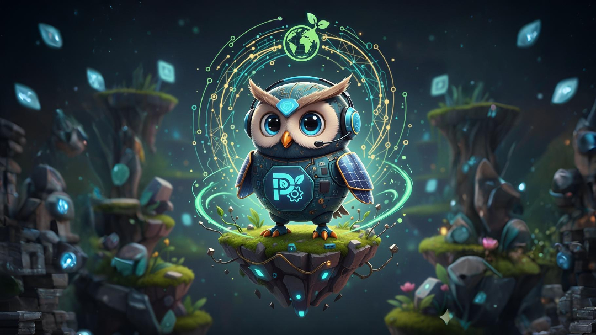

# Aurora: privacy-first local assistant platform



[](https://github.com/joaojhgs/aurora/actions/workflows/python-tests.yml)
[](https://github.com/joaojhgs/aurora/actions/workflows/quality.yml)
[](https://github.com/joaojhgs/aurora/actions/workflows/e2e.yml)
[](https://opensource.org/licenses/MIT)
[](docs/INSTALL.md)

Aurora is a modular assistant runtime for local automation, voice interaction, mesh-connected devices, and privacy-first productivity workflows. It combines Python microservices, a typed message bus, Gateway/Auth/mesh boundaries, and SDK-first frontend surfaces for web and Tauri desktop/mobile shells.

## Current capabilities

- **Voice pipeline:** wakeword, STT coordinator/transcription services, TTS service, and assistant orchestration.
- **LLM orchestration:** LangGraph/LangChain service with OpenAI, HuggingFace endpoint/local, and llama.cpp-oriented profiles.
- **Tooling and MCP:** built-in tools, plugin-style integrations, and MCP server support.
- **Persistence:** SQLite/RAG storage, message history, scheduler persistence, and policy-gated mesh data sharing.
- **Gateway and API:** FastAPI Gateway dynamically exposes service contracts with typed request/response schemas.
- **Auth and permissions:** principals, pairing, tokens, topic permissions, audit, and Gateway ACL boundaries.
- **Mesh:** peer pairing, capability graph, explicit routing/share policy, and transport E2E harnesses.
- **Frontend:** TypeScript SDK, shared React UI package, web shell, Tauri desktop/mobile shell, and PyQt fallback/reference.
- **Tauri desktop packaging:** profile-specific Python sidecar builds, thin default packages, and explicit heavy local-model profiles.
- **Process mode:** Redis-backed service containers for production-style development and deployment.
- **Backup contracts:** admin backup manifests, list/verify, and dry-run restore/rollback impact plans.

See [`docs/FEATURE_MATRIX.md`](docs/FEATURE_MATRIX.md) for readiness boundaries.

## Quick start

Aurora uses Python 3.10-3.11 and `uv`.

```bash
curl -LsSf https://astral.sh/uv/install.sh | sh
uv sync --extra dev-third-party
uv run python main.py
```

Useful profiles:

```bash
# CPU local assistant development
uv sync --extra dev-local-cpu

# GPU local assistant development
uv sync --extra dev-local-gpu

# Test dependencies
uv sync --extra test-all
```

More setup detail: [`docs/INSTALL.md`](docs/INSTALL.md), [`docs/UV_USAGE.md`](docs/UV_USAGE.md), [`docs/DEPENDENCIES.md`](docs/DEPENDENCIES.md).

## Process mode and Docker

Process mode runs each service separately with Redis-backed messaging:

```bash
docker compose -f docker-compose.process.yml up -d
```

See [`README.process-mode.md`](README.process-mode.md) and [`docs/TILT.md`](docs/TILT.md).

## Frontend and Tauri

The production UI direction is SDK-first:

- `packages/aurora-sdk` — transport-independent `AuroraClient`.
- `packages/aurora-ui` — shared React UI primitives.
- `apps/aurora-web` — web shell.
- `apps/aurora-tauri` — Tauri desktop/mobile shell with local sidecar support.
- `app/ui` — PyQt fallback/reference.

See [`docs/FRONTEND_AND_UI_ARCHITECTURE.md`](docs/FRONTEND_AND_UI_ARCHITECTURE.md) and [`docs/TAURI_DESKTOP_BUILD.md`](docs/TAURI_DESKTOP_BUILD.md).

## Development checks

```bash
make format
make lint
make check
make unit
make integration
uv run python scripts/check_docs.py
```

TypeScript packages:

```bash
pnpm install --frozen-lockfile
pnpm --filter @aurora/client test
pnpm --filter @aurora/ui test
pnpm --filter @aurora/tauri-ui test
```

CI lanes are documented in [`docs/CI_CD.md`](docs/CI_CD.md).

## Documentation map

Start with [`docs/DOCS_INDEX.md`](docs/DOCS_INDEX.md). Key docs:

- [`docs/ARCHITECTURE.md`](docs/ARCHITECTURE.md)
- [`docs/MESSAGING_ARCHITECTURE.md`](docs/MESSAGING_ARCHITECTURE.md)
- [`docs/API_AND_CONTRACTS.md`](docs/API_AND_CONTRACTS.md)
- [`docs/GATEWAY.md`](docs/GATEWAY.md)
- [`docs/AUTH_AND_PERMISSIONS.md`](docs/AUTH_AND_PERMISSIONS.md)
- [`docs/PEER_PAIRING_FLOW.md`](docs/PEER_PAIRING_FLOW.md)
- [`docs/CONFIG_SERVICE_PATTERN.md`](docs/CONFIG_SERVICE_PATTERN.md)
- [`docs/BACKUP_SERVICE.md`](docs/BACKUP_SERVICE.md)
- [`docs/MCP_INTEGRATION.md`](docs/MCP_INTEGRATION.md)

Historical handoffs, investigation outputs, and task-specific plans are not current guidance; see [`docs/DOC_MAINTENANCE.md`](docs/DOC_MAINTENANCE.md).
