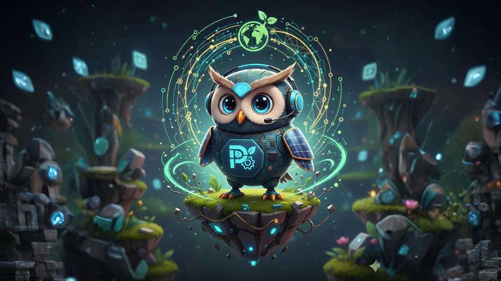

# Aurora: a privacy-first assistant platform



[](https://github.com/joaojhgs/aurora/actions/workflows/python-tests.yml)
[](https://github.com/joaojhgs/aurora/actions/workflows/quality.yml)
[](https://app.codecov.io/gh/joaojhgs/aurora)
[](https://app.codecov.io/gh/joaojhgs/aurora)
[](https://app.codecov.io/gh/joaojhgs/aurora)
[](LICENSE)
[](docs/INSTALL.md)

Aurora is a modular voice and automation platform that can run as a private local node, a multi-service server, or a client connected from the web, desktop, Android, or iOS. Its Python services provide speech, LLM orchestration, tools, storage, scheduling, authentication, and mesh connectivity; the TypeScript SDK and shared React UI keep the application experience consistent across surfaces.

This README is the project entry point. It explains which Aurora surface to use and how to start it. For current capability boundaries, architecture contracts, and detailed operations, use the [documentation index](docs/DOCS_INDEX.md) and [feature matrix](docs/FEATURE_MATRIX.md).

## Choose how to run Aurora

| Surface | What it provides | Python on that device? | Best fit |
| --- | --- | --- | --- |
| **Aurora server/node** | The full service runtime, Gateway, automation, voice services, storage, and mesh participation. | Yes | A home node, workstation assistant, or self-hosted server. |
| **Hosted web UI** | The self-hosted Aurora application in a browser, connected at runtime by an invite or Gateway profile. | No | Access from any modern desktop or mobile browser. |
| **Desktop local** | Tauri desktop app plus a supervised local Aurora sidecar, loopback Gateway, and native speech engine. | Bundled | A desktop assistant with core local services; heavier Python audio/model profiles remain separate builds. |
| **Desktop client** | Python-free Tauri app that connects to another Aurora node as a remote console or mesh node. | No | A lighter desktop install or a second computer. |
| **Android client** | Python-free Tauri/WebView app with Android-native permissions, secure storage, invites, and foreground capabilities. | No | Phone or tablet access to an Aurora node. |
| **iOS client** | Python-free Tauri/WKWebView app with iOS-native secure storage and client integration points. | No | iPhone/iPad access; building requires macOS and Xcode. |
| **PyQt UI** | The original Python UI retained as a fallback/reference surface. | Yes | Existing Python-first workflows. |

The physical platform does not hard-code the device's role. Hosted web, desktop client, Android, and iOS profiles can act as a **remote console** or an approved **mesh node**. The published Linux desktop-local package includes Aurora's minimal Python service tier; source builds can select the larger local-audio and model profiles. Connection profiles select HTTP, WebRTC, or WebRTC-preferred behavior at runtime; client artifacts do not compile a server endpoint or role into the application.

## What Aurora includes

- **Voice:** wakeword, coordinated speech-to-text, push-to-talk, text-to-speech, and streaming assistant responses.
- **Assistant orchestration:** LangGraph/LangChain workflows with OpenAI, Hugging Face, and llama.cpp-oriented profiles.
- **Tools and integrations:** built-in automation tools, optional provider integrations, and Model Context Protocol support.
- **Local data:** SQLite-backed history, retrieval, scheduling, and policy-controlled backup operations.
- **API and mesh:** typed Gateway routes, authentication, permissions, pairing, peer capabilities, and direct peer sessions.
- **Shared applications:** one TypeScript SDK and React UI across hosted web and Tauri desktop/mobile shells.
- **Deployment choices:** single-process thread mode for local use or Redis-backed service containers for process mode.

Aurora is under active development. Browser and Linux desktop paths have the broadest live validation today; Android has build, emulator, and Waydroid coverage, while physical-device power behavior remains a separate release gate. iOS source and policy checks run cross-platform, but simulator, signing, and device validation require macOS/Xcode. See the [feature matrix](docs/FEATURE_MATRIX.md) for the precise, current boundary.

## Prerequisites

Clone the workspace first:

```bash
git clone https://github.com/joaojhgs/aurora.git
cd aurora
```

Install only the toolchains needed for the surface you are building:

| Work | Toolchain |
| --- | --- |
| Python server or local sidecar | Python 3.10 or 3.11 and [`uv`](https://docs.astral.sh/uv/) |
| Web UI and shared frontend | Node.js 24 and pnpm 10.25 (the repository pins pnpm through `packageManager`) |
| Desktop/mobile native shell | Rust 1.88 plus the Tauri platform prerequisites |
| Android package | Android Studio/SDK and the generated Tauri Android project |
| iOS package | macOS, Xcode, and the generated Tauri iOS project |

Aurora uses `uv` for Python dependency management; Conda and unconstrained editable installs are not supported setup paths for the runtime profiles.

## Setup: Aurora server or local node

### Install a published server release

Published server archives contain the Aurora wheel, a Gateway-enabled server configuration, and a versioned installer. The command below downloads the exact tagged archive, verifies it against the release `SHA256SUMS`, and creates a managed Python 3.11 environment with Aurora's core server services:

```bash
AURORA_VERSION=2.0.0-rc.1
curl -fsSL "https://raw.githubusercontent.com/joaojhgs/aurora/v${AURORA_VERSION}/scripts/install_release.sh" \
  | sh -s -- server "$AURORA_VERSION"
~/.local/bin/aurora-server
```

Install [`uv`](https://docs.astral.sh/uv/) first if it is not already available. Releases are installed under `~/.local/share/aurora/server/<version>` so different versions remain explicit and recoverable. The archive enables the Gateway and disables local Python STT/TTS by default; browser and native clients can provide voice, while a source install remains the path for full local audio/model profiles. Use `--prefix` or `--bin-dir` after the version to choose other locations.

### Guided setup

The setup assistant detects the platform and hardware, installs the selected runtime profile, and creates local configuration:

```bash
./setup.sh       # Linux or macOS
setup.bat        # Windows
```

Then start Aurora in the default single-process thread mode:

```bash
uv run python main.py
```

### Manual setup

For a node backed by third-party model APIs and available to web/desktop/mobile clients:

```bash
curl -LsSf https://astral.sh/uv/install.sh | sh
uv sync --extra third-party --extra gateway
uv run python main.py
```

On first run Aurora creates the ignored `config.json` from the tracked defaults. Set `services.gateway.enabled` to `true` when other devices or browser clients need to connect, and keep secrets such as API keys in `.env`, never in committed configuration. A remotely exposed Gateway should sit behind the authentication and TLS/network controls described in the [Gateway](docs/GATEWAY.md) and [auth/permissions](docs/AUTH_AND_PERMISSIONS.md) guides.

Other common Python profiles:

```bash
uv sync --extra local-huggingface       # Local CPU-oriented model profile
uv sync --extra local-huggingface-gpu   # Local GPU-oriented model profile
uv sync --extra dev-third-party         # Contributor environment using APIs
uv sync --extra dev-local-cpu            # Contributor environment using local CPU models
```

See the [installation guide](docs/INSTALL.md), [dependency profiles](docs/DEPENDENCIES.md), and [`uv` workflow](docs/UV_USAGE.md) before changing model or hardware backends.

### Process mode and Docker

For production-style separation, Aurora runs services in individual containers with Redis-backed messaging:

```bash
docker compose -f docker-compose.process.yml up -d
```

Use [README.process-mode.md](README.process-mode.md) for the topology and environment variables, or [docs/TILT.md](docs/TILT.md) for the Compose-based development stack.

## Setup: hosted web UI

The hosted UI is the Next.js shell in `apps/aurora-web`. It contains no Python runtime and connects to an Aurora node through a runtime profile or imported invite.

To install a published standalone web archive with Node.js 24 already available:

```bash
AURORA_VERSION=2.0.0-rc.1
curl -fsSL "https://raw.githubusercontent.com/joaojhgs/aurora/v${AURORA_VERSION}/scripts/install_release.sh" \
  | sh -s -- web "$AURORA_VERSION"
PORT=3000 ~/.local/bin/aurora-web
```

The installer verifies the release checksum and keeps the extracted application under `~/.local/share/aurora/web/<version>`.

Install the frontend workspace and start the local web host:

```bash
corepack enable
pnpm install --frozen-lockfile
pnpm dev:web
```

For local end-to-end development, set `services.gateway.enabled` to `true` in the ignored `config.json`, then start the Aurora node in another terminal:

```bash
pnpm dev:python-service
```

At first launch, choose the local device name and role, then import an invite or configure the approved connection profile. Browser security rules still require an appropriate HTTPS/WSS deployment when the web UI connects beyond loopback.

Build the unsigned standalone web release artifact with:

```bash
pnpm --filter @aurora/web package:unsigned
```

The web shell, SDK boundary, browser storage posture, and supported connection modes are documented in [Frontend and UI Architecture](docs/FRONTEND_AND_UI_ARCHITECTURE.md).

## Setup: desktop apps

Both desktop modes use the same Tauri shell and shared UI. Install the frontend dependencies first:

```bash
corepack enable
pnpm install --frozen-lockfile
```

### Desktop local

Desktop local starts Vite, the Rust/Tauri shell, and a supervised Python service in one development command. Prepare the minimal local service profile, then launch it:

```bash
uv sync --extra sidecar-thin
pnpm dev:desktop-local
```

For an unsigned packaged local build:

```bash
pnpm --filter @aurora/tauri-ui build:bundle:desktop-local
```

Larger local-audio and hardware-specific sidecar profiles are available for CPU, CUDA, ROCm, Metal, Vulkan, SYCL, and RPC deployments. Their native speech runtime and packaging requirements are intentionally kept in the [desktop build guide](docs/TAURI_DESKTOP_BUILD.md).

Canonical releases publish the Linux sidecar build separately as `aurora-<version>-desktop-local-linux-x86_64.AppImage`, `.deb`, and `.rpm`. These are distinct from the Python-free desktop-client packages, so the two installation choices cannot be confused on the [Releases page](https://github.com/joaojhgs/aurora/releases).

### Desktop client

Desktop client starts no Python sidecar. It connects to a server or peer selected during onboarding and stores secrets using the platform credential store:

```bash
pnpm dev:desktop-client
```

Build and verify an unsigned Python-free package with:

```bash
pnpm --filter @aurora/tauri-ui build:bundle:desktop-client
pnpm --filter @aurora/tauri-ui verify:bundle:desktop-client
```

Linux packages have live runtime coverage; macOS and Windows packages are built and inspected in their native CI lanes, with platform-specific live validation tracked separately. See the [Tauri shell README](apps/aurora-tauri/README.md) for bundle formats and platform prerequisites.

Canonical releases name the Python-free packages `aurora-<version>-desktop-client-*`: AppImage/DEB/RPM on Linux, DMG on macOS arm64, and MSI/NSIS installers on Windows x86_64.

## Setup: mobile apps

Android and iOS use the same Python-free SDK/WebView client model as desktop client. They connect to an Aurora server or peer at runtime and do not package Python, models, or server endpoints.

### Android

After installing the shared frontend and Tauri prerequisites, generate the Android project, run its CI-safe preflight, and build an unsigned debug APK:

```bash
pnpm --filter @aurora/tauri-ui android:init
pnpm --filter @aurora/tauri-ui android:preflight:ci
pnpm --filter @aurora/tauri-ui android:build:client:apk
pnpm --filter @aurora/tauri-ui android:verify:client:apk
```

For a Play-oriented bundle, replace the final build/verify pair with:

```bash
pnpm --filter @aurora/tauri-ui android:build:client:aab
pnpm --filter @aurora/tauri-ui android:verify:client:aab
```

These commands produce unsigned development artifacts. Release signing, Play Console publication, physical-device Doze/OEM survival, battery, and thermal validation require separate credentials and device testing. Android development defaults to Waydroid on this repository's development host; CI-equivalent emulator testing remains the compatibility gate.

### iOS

Policy and source checks can run on any platform:

```bash
pnpm --filter @aurora/tauri-ui ios:policy
pnpm --filter @aurora/tauri-ui ios:prepare:client
```

Generating and running the application requires macOS and Xcode:

```bash
pnpm --filter @aurora/tauri-ui tauri ios init
pnpm --filter @aurora/tauri-ui ios:preflight
pnpm --filter @aurora/tauri-ui ios:build:client:simulator
pnpm --filter @aurora/tauri-ui ios:smoke:simulator
```

The simulator package is unsigned and Python-free. Device signing, TestFlight/App Store work, physical-device networking, and durable background behavior are separate release gates. See the [Tauri shell README](apps/aurora-tauri/README.md#ios-policy-and-signing-preflight) for the macOS workflow and credential-gated commands.

## Architecture at a glance

```text
Hosted web / Desktop / Android / iOS
                  │
             AuroraClient
                  │
        HTTP/SSE, WebRTC, or Tauri IPC
                  │
        Gateway + Auth + typed contracts
                  │
     LocalBus (threads) or BullMQ/Redis (processes)
                  │
 Config · DB · Tools · Scheduler · STT · TTS · Orchestrator
```

Services never call each other directly; typed contracts travel through the message bus. The Gateway exposes approved contracts to SDK clients, while the Auth service controls identity, pairing, permissions, and audit boundaries. Read [Architecture](docs/ARCHITECTURE.md), [Messaging Architecture](docs/MESSAGING_ARCHITECTURE.md), and [API and Contracts](docs/API_AND_CONTRACTS.md) before changing those boundaries.

## Repository map

| Path | Purpose |
| --- | --- |
| `app/` | Python services, message buses, shared contracts/configuration, and the PyQt fallback. |
| `packages/` | TypeScript SDK, shared React UI, web voice, and mesh authority packages. |
| `apps/aurora-web/` | Hosted Next.js application. |
| `apps/aurora-tauri/` | Desktop, Android, and iOS Tauri shell. |
| `rust/` | Shared native and WebAssembly voice/runtime crates. |
| `tests/` | Python unit, integration, E2E, and performance suites. |
| `docker/` and `docker-compose*.yml` | Per-service images and process-mode deployments. |
| `docs/` | Canonical architecture, operations, security, and development guidance. |

## Development and verification

Read the root [`AGENTS.md`](AGENTS.md) and the nearest subsystem guide before editing. The common checks are:

```bash
make format
make lint
make check
make unit
make integration
make check-docs
```

Frontend and native checks are package-specific:

```bash
pnpm --filter @aurora/client build
pnpm --filter @aurora/client test
pnpm --filter @aurora/ui test
pnpm --filter @aurora/web build
pnpm --filter @aurora/tauri-ui test
make check-rust-voice
```

See [CI/CD Workflows](docs/CI_CD.md), [Testing](tests/README.md), and [Contributing](docs/CONTRIBUTE.md) for the full validation map.

## Documentation

Start with [docs/DOCS_INDEX.md](docs/DOCS_INDEX.md). The most useful entry points are:

- [Architecture](docs/ARCHITECTURE.md)
- [Feature Matrix](docs/FEATURE_MATRIX.md)
- [Frontend and UI Architecture](docs/FRONTEND_AND_UI_ARCHITECTURE.md)
- [Client Surface Status](docs/UI_CLIENT_SURFACE_STATUS.md)
- [Installation](docs/INSTALL.md)
- [Configuration](docs/CONFIG_SERVICE_PATTERN.md)
- [Gateway](docs/GATEWAY.md)
- [Auth and Permissions](docs/AUTH_AND_PERMISSIONS.md)
- [Backup Service](docs/BACKUP_SERVICE.md)
- [MCP Integration](docs/MCP_INTEGRATION.md)
- [Documentation Maintenance](docs/DOC_MAINTENANCE.md)

Historical handoffs, archived investigations, and task plans are provenance—not current implementation guidance.

## Contributing, security, and license

Contributions are welcome; begin with [docs/CONTRIBUTE.md](docs/CONTRIBUTE.md). Report security issues according to [SECURITY.md](SECURITY.md). Aurora is available under the [MIT License](LICENSE).
