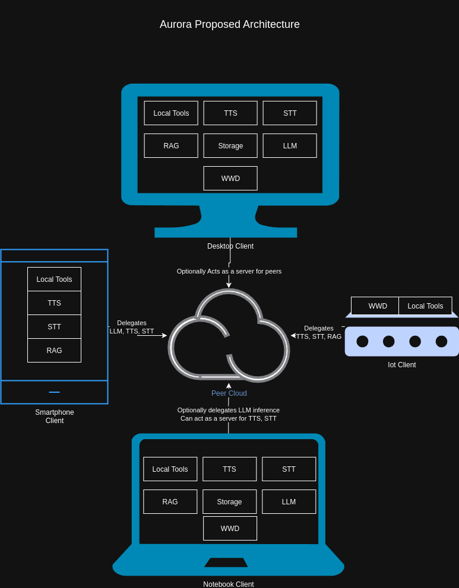

# Aurora: Intelligent Voice Assistant for Local Automation and Productivity


[](https://github.com/joaojhgs/aurora/actions/workflows/test-core.yml)
[](https://codecov.io/gh/joaojhgs/aurora)
[](https://opensource.org/licenses/MIT)
[](https://github.com/aurora-ai/aurora)

Aurora is an intelligent voice assistant designed to enhance productivity through local, privacy-focused automation. It leverages real-time speech-to-text, a large language model (LLM), and open-source tools to provide a seamless and intuitive user experience.

**It's objective is to be the privacy-first swiss knife of assistants, allowing unprecedentedly easy extension and addition of tools for productivity, every day life and work life.**

---

## 📋 Table of Contents

- [Features](#features)
- [Installation and Usage](#installation-and-usage)
  - [🚀 Quick Start](#-quick-start)
  - [📚 Need More Details?](#-need-more-details)
  - [📦 Model Management](#-model-management)
- [Libraries and Tools](#libraries-and-tools)
- [Architecture](#architecture)
- [Long Term Vision](#long-term-vision)
- [Why Aurora?](#why-aurora)

---

## Features

1. **Wakeword Detection**:
   - Activate the assistant with a custom wakeword (e.g., "Jarvis").
   - Offline and low-latency detection using **OpenWakeWord**.

2. **Real-Time Speech-to-Text (STT)**:
   - Convert user speech into text using **Whisper** (OpenAI's lightweight model for local processing).
   - **Ambient Transcription**: Continuous background audio transcription for day summaries with priority queue system.

3. **Large Language Model (LLM) Integration**:
   - **Multi-Provider Support**: Choose from OpenAI, HuggingFace Pipeline (local), HuggingFace Endpoint (remote), or Llama.cpp
   - **Local Models**: Use **Llama 3**, **Mistral 7B**, **Gemma 2 and 3** (quantized for efficiency) or any HuggingFace model locally
   - **Remote Models**: Access HuggingFace Inference Endpoints for cloud-based inference
   - **Structured Configuration**: Organized LLM settings with provider-specific parameter control
   - Orchestrate tool calls (e.g., OpenRecall, browser-use) using **LangChain** and **Langgraph**.

4. **Semantic Search with OpenRecall**:
   - Index and retrieve information from periodic screenshots and activities using **OpenRecall**.
   - Enable queries like, "What did I research about interfaces at 2 PM?"
   - Enrich the assistant context by adding past activities when necessary

5. **Text-to-Speech (TTS)**:
   - Generate natural-sounding audio responses using **Piper** (offline TTS).

6. **Modern User Interface**:
   - Graphical user interface with both text and voice input options
   - Dark mode and light mode support
   - Real-time status indicators for listening, processing, and speaking states
   - Message history with timestamps

7. **Local and Privacy-Focused**:
   - All processing happens locally, ensuring data privacy and security.
   - No cloud dependencies or data sharing.

8. **Modular Tooling and Integrations**:
   - All integrations and tools are available through *plugins* which you can activate through the envs
   - Only install dependencies for the plugins you'll want to use, keeping the sizes low
   - Easy setup, just need to activate it and fill the correct env credentials if necessary

9. **MCP (Model Context Protocol) Support**:
   - Connect to external MCP servers to extend Aurora's capabilities
   - Support for both local (stdio) and remote (HTTP) MCP servers
   - Dynamic tool loading from MCP servers with authentication support
   - Full integration with Aurora's semantic tool selection system

---

## Installation and Usage

### 🚀 Quick Start

1. **Clone the repository:**
   ```bash
   git clone https://github.com/joaojhgs/aurora.git
   cd aurora
   ```

2. **Run the guided setup:**
   ```bash
   # Linux/macOS
   ./setup.sh
   
   # Windows  
   setup.bat
   ```
   
   The setup script will:
   - ✅ Check Python version compatibility (requires Python 3.9-3.11)
   - ✅ Detect your hardware and install optimal packages
   - ✅ Install all dependencies automatically
   - ✅ Guide you through configuration

3. **Configure your environment:**
   - Copy `.env.file` to `.env` and add any API keys you want to use
   - Modify `config.json` if needed (defaults work for most users)

4. **Run Aurora:**
   ```bash
   python main.py
   ```

### 📚 Need More Details?

- **Complete Installation Guide**: See [docs/INSTALL.md](docs/INSTALL.md) for:
  - Manual installation options
  - Advanced hardware acceleration setup
  - Troubleshooting and configuration details
  - Platform-specific instructions
  
- **Python Version Requirements**: Aurora requires Python 3.10-3.11 (Python 3.12+ causes dependency conflicts)

- **Model Management**: Aurora includes models for offline operation - see Model Management below

### 📦 Model Management

Aurora stores model files in dedicated directories at the project root:

**Chat Models** (`chat_models/`):
- Large language models in GGUF format (2-4GB each)
- Configure in `config.json`: `"llama_cpp_model_path": "chat_models/model-name.gguf"`
- Download more from [Hugging Face GGUF models](https://huggingface.co/models?library=gguf)

**Voice Models** (`voice_models/`):
- Text-to-speech (Piper) and wake word models
- Configure in `config.json`: `"model_file_path": "/voice_models/voice-name.onnx"`
- Download more from [Piper Voices](https://github.com/rhasspy/piper/blob/master/VOICES.md)

*See `chat_models/README.md` and `voice_models/README.md` for detailed model information.*

---

## Architecture

Aurora is built with a modular, plugin-based architecture that prioritizes privacy, extensibility, and local processing. The system follows a clear data flow from voice input to intelligent response generation, with each component designed to be independently configurable and replaceable.

### System Overview


### Key Architectural Components

#### 1. **Configuration Management**
- **Centralized Configuration**: The `config_manager.py` handles all system settings through JSON schema validation
- **Hybrid Configuration**: Combines `config.json` for structured settings and `.env` for sensitive credentials
- **Plugin Activation**: Configuration-driven plugin system that loads only required dependencies

#### 2. **Audio Processing Pipeline**
- **Wake Word Detection**: Always-listening background service using OpenWakeWord
- **Speech-to-Text**: Real-time transcription with Whisper through RealtimeTTS
- **Threaded Architecture**: Non-blocking audio processing to maintain UI responsiveness

#### 3. **LangGraph Orchestration**
- **Intelligent Routing**: LangGraph coordinates between LLM reasoning and tool execution
- **Dynamic Tool Selection**: RAG-based tool matching using vector embeddings of tool descriptions
- **Context Management**: Maintains conversation context and integrates historical data


#### 4. **Plugin System**
- **Modular Design**: Each integration is a separate plugin with independent dependencies
- **Conditional Loading**: Plugins are loaded only when enabled in configuration
- **Extensible Architecture**: New tools can be added without modifying core system

#### 5. **Memory & Storage**
- **Vector Storage**: Embeddings-based memory for semantic search and context retrieval
- **Message Persistence**: SQLite database for conversation history and system state
- **Efficient Retrieval**: Optimized queries for both recent context and long-term memory

#### 6. **User Interface**
- **Dual Mode Operation**: Supports both GUI (PyQt6) and headless command-line operation
- **Real-time Feedback**: Visual indicators for system state (listening, processing, speaking)
- **Flexible Input**: Both voice and text input methods supported

### Data Flow

1. **Input Processing**: Voice input → Wake word detection → Speech-to-text transcription
2. **Intent Understanding**: Text → LangGraph → LLM analysis → Tool selection
3. **Action Execution**: Selected tools execute with context from memory and database
4. **Response Generation**: Tool results → LLM synthesis → Natural language response
5. **Output Delivery**: Response → Text-to-speech → Audio output + UI display
6. **Persistence**: Conversation and context saved to database and vector store

This architecture ensures Aurora remains privacy-focused (all processing local), extensible (plugin system), and efficient (threaded processing with intelligent caching).

---

# Long term vision and Roadmap:

- [ ] Turn Aurora into a server-client architecture
   - [ ] Allow server to receive and process audio using the RealtimeSTT and stream back the TTS audio to the client
   - [ ] Allow clients to have it's own local tools that can be called by the server (either custom framework or using MCP)
   - [ ] Create code for low-cost physical clients such as ESP32
   - [ ] Allow clients to connect to each other using WebRTC, allowing for peer-to-peer architecture as well as server/client.

The Idea here is to allow for low-cost and easily built interfaces that you can interact with your Jarvis across your home and private network.

Also by allowing client side tools aside from the ones we can use on the Desktop, we allow the assistant to potentially control real world appliances, or even multiple devices/desktops.

- [ ] Integrations with Home Assistant
   - [ ] Allow for tool calling with smart home appliances




### Need Help?

If you have questions or need help, feel free to:
- Open an issue with your question
- Join our community discussions
- Check the existing documentation in the `/docs` directory